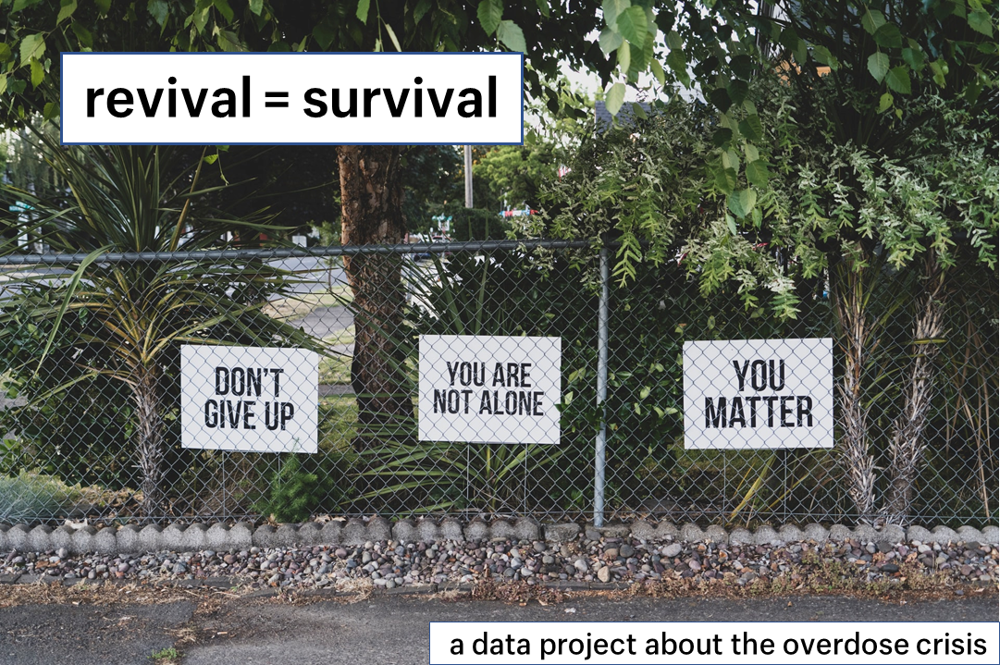

# Revival = Survival: a data project on the overdose crisis

## Overview
I learned at a Shopify internship process webinar that applicants would need to submit a personal coding project to walk through. So I decided to build something from scratch by the deadline. And I wanted to ensure my project would be different from everyone else's. 

I chose to focus on the opiate overdose crisis because of my interest in social-justice issues. And it's personal, too; I lost my cousin, Vince, my uncle, Kevin and Xephiral, my friend. The theme is relevant to my application, as well: Shopify empowers merchants and consumers — but you can't become empowered if you're dead. 

The opiate overdose crisis sits at the nexus of two intractable social forces — (1) rampant overprescribing of addictive medications, and (2) a toxic, unregulated street drug supply. No one deserves to die because of that. And now there's a chance for them to get better. Once revived, they can survive.

Naloxone, a treatment that can temporarily reverse an opioid overdose, is available free at pharmacies around Ontario and across Toronto. 

The purpose of this project is two-fold. First, I use data visualization tools and techniques to tell the story of the overdose epidemic. Second, I've built a simple tool based on a geo-spatial dataset that can inform concerned and compassionate people about the locations of the nearest pharmacies where they can access naloxone. Carrying it on their person, anyone can save a life. 

## Configuration
This project was set up using an anaconda virtual environment:

<code>conda create --name shopify flask  numpy pandas requests</code> 

Run the following from a command prompt whilst inside the environment:

<code>conda install -c conda-forge folium
conda install -c gusdunn pdfplumber</code>

If you cannot install pdfplumber for your OS, don't worry. The output of the data manipulation for which it is used is saved in the /csv folder. Full details within the Jupyter Notebook.

## Roadmap/next steps
Here is a list of next steps for this project:
 
<ul>
    <li>Try out additional geocoding APIs</li>
    <li>Rewrite the main piece of code</li>
</ul>

## Data sources

### Visualizations

<ul>
    <li></li>

## References
I reviewed the following relevant references whilst working on **Revival = Survival**:
<ul>
    <li>
        <a href='http://www.openstreetmap.org'>Open Street Map</a>
    </li>
    <li>
        <a href='https://polaris.shopify.com'>Shopify Polaris</a>
    </li>
    
    <li>
        <a href='https://medium.com/@george.seif94/a-tour-of-the-top-5-sorting-algorithms-with-python-code-43ea9aa02889'>A tour of the top 5 sorting algorithms with Python code</a>
    </li>
    <li>
        <a href='https://www.arcgis.com/home/webmap/viewer.html?webmap=b44592265a7e405d95be7d811e1a52ef'>ArcGIS City of Toronto basemap</a>
    </li>
    <li>
        <a href='https://open.toronto.ca/dataset/neighbourhoods/'>City of Toronto Open Data Project: Neighbourhoods</a>
    </li>
    <li>
        <a href='https://medium.com/@lisachen_7431/using-folium-to-visualize-distribution-of-public-services-in-140-toronto-neighbourhoods-e53271b7f43f?sk=cac47558e62ead38bd07e0e335f49c44&fbclid=IwAR2N5CnDwXumLtgUajXNiEWy8SP8IFGah8klYc8eIhkki-mOeel6YrJATDo'>Using Folium to Visualize Distribution of Public Services in 140 Toronto Neighbourhoods</a>
    </li>
    <li>
        <a href='https://developer.here.com/blog/understanding-geocoding-with-python'>Geocoding a Location Using Python and Flask</a>
    </li> 
    <li>
        <a href='https://jakevdp.github.io/PythonDataScienceHandbook/04.13-geographic-data-with-basemap.html'>Geographic Data with Basemap</a>
    </li>
    <li>
        <a href='https://datascience.quantecon.org/applications/maps.html'>Mapping in Python – QuantEcon DataScience</a>
    </li>
    <li>
        <a href='https://mobiforge.com/design-development/geo-sorting-using-device-geolocation-to-sort-distance'>Geo-sorting: Using Device Geolocation to Sort by Distance</a>
    </li>
    <li>
        <a href='http://maps.stamen.com'>Map Stack | Stamen Design</a>
    </li>
    <li>
        <a href='https://www.kite.com/python/answers/how-to-find-the-distance-between-two-lat-long-coordinates-in-python'>How to find the distance between two lat-long coordinates in Python</a>
    </li>
    <li>
        <a href='https://oslandia.com/en/2017/07/03/openstreetmap-data-analysis-how-to-parse-the-data-with-python/'>OpenStreetMap data analysis: how to parse the data with Python?</li>
    </a>
    <li>
        <a href='https://towardsdatascience.com/mapping-with-matplotlib-pandas-geopandas-and-basemap-in-python-d11b57ab5dac'>Mapping with Matplotlib, Pandas, Geopandas and Basemap in Python</a>
    </li>
    <li>
        <a href='https://towardsdatascience.com/geopandas-101-plot-any-data-with-a-latitude-and-longitude-on-a-map-98e01944b972'>GeoPandas 101</a>
    </li>
    <li>
        <a href='https://geopandas.readthedocs.io/en/latest/gallery/create_geopandas_from_pandas.html'>Creating a GeoDataFrame from a DataFrame with coordinates</a>
    </li>
    <li>
        <a href='https://www.ontario.ca/page/get-naloxone-kits-free'>Recognize and temporarily reverse an opioid overdose</a>
    </li>
    <li><a href='https://github.com/mcrr/isleofinsanityandhope/'>Github for *Isle of Insanity and Grief: Overcoming my son's overdose and death*</a>
    </li>
</ul>